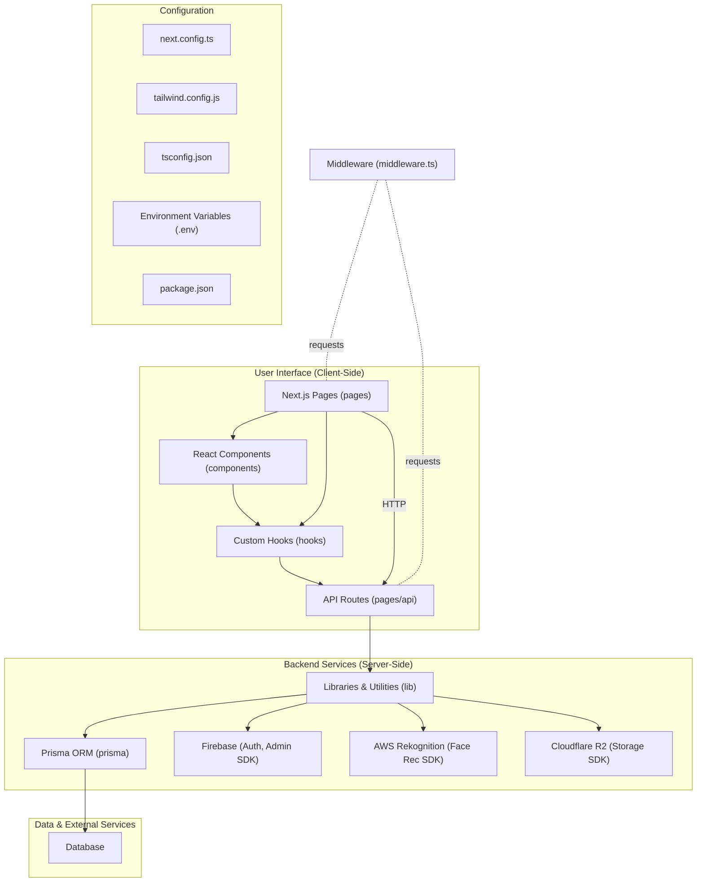

# Application Architecture

This document outlines the architecture of the Next.js application.

## Overview

The application is a full-stack Next.js application with distinct frontend and backend capabilities, leveraging several external services for specialized functionalities. It follows a typical Next.js project structure, separating pages, components, API routes, server-side libraries, and configuration files.

### 1. Frontend (Client-Side)

Responsible for rendering the user interface and handling user interactions.

-   **`pages/`**: Defines the application's routes and top-level page components.
    -   `index.tsx`: The main landing page of the application, likely showcasing topics or a feed.
    -   `_app.tsx`: Custom Next.js App component. Used for global layout, injecting global CSS, and maintaining global state (e.g., through context providers or state management libraries).
-   **`components/`**: Contains reusable React UI components that are composed to build pages. These components are designed to be modular and maintain a consistent look and feel.
    -   **Layout & Navigation**: `Navbar.tsx`, `RightPanel.tsx`.
    -   **Modals & Dialogs**: `ProfileModal.tsx`, `BanWarnDialog.tsx`, `AuthModal.tsx` (in `components/auth/`).
    -   **Topics & Comments**: `TopicList.tsx`, `TopicItem.tsx`, `TopicPopup.tsx`, `TopicBody.tsx`, `CommentForm.tsx`, `CommentList.tsx`.
    -   **Content Display**: `AvatarPlayer.tsx` (for displaying user avatars, possibly animated), `AssetCarousel.tsx`, `AssetCard.tsx`, `StatsSection.tsx`, `StatsCard.tsx`.
    -   **User Interaction**: `ProfileButton.tsx`, `AssetCounter.tsx`.
    -   **Generic**: `BannerBase.tsx`, `Banner.tsx`.
    -   `VisitorCount.tsx`: Displays visitor statistics.
-   **`hooks/`**: Houses custom React hooks for encapsulating and reusing stateful logic, data fetching, and side effects across components.
    -   `useComments.ts`: Manages fetching, creating, and updating comments for topics.
    -   `useLikes.ts`: Handles logic for liking/unliking topics or comments.
    -   `useFirebaseNextAuth.tsx`: Provides client-side integration with Firebase and NextAuth for user session management and authentication state.
    -   `useVisitorCount.ts`: Fetches and updates visitor count data.
    -   `use-toast.ts`: A utility hook for displaying toast notifications.
-   **`public/`**: Stores static assets like images, fonts, and other files that are served directly by the web server.
-   **`styles/`**: Contains global stylesheets and theme configurations.
    -   `tailwind.css`: Main Tailwind CSS file, importing base styles, components, and utilities.

### 2. Backend (Server-Side)

Handles API requests, business logic, data processing, and integration with external services.

-   **`pages/api/`**: Implements server-side API endpoints that the frontend (or external clients) can call.
    -   `auth/[...nextauth].ts`: NextAuth.js dynamic route that handles all authentication-related requests (sign-in, sign-out, session management, OAuth callbacks). It uses the configuration defined in `lib/authOptions.ts`.
    -   `topics/`:
        -   `index.ts`: Handles requests for listing topics or creating new topics (e.g., `GET /api/topics`, `POST /api/topics`).
        -   `[id]/`: Dynamic API routes for operations on specific topics (e.g., `GET /api/topics/:id`, `PUT /api/topics/:id`, `DELETE /api/topics/:id`).
    -   `check-face-duplicate.ts`: An API endpoint that likely takes an image URL and uses AWS Rekognition to check if a similar face already exists in the database collection. Part of the user registration or profile update flow.
    -   `avatar-gen.ts`: API endpoint potentially responsible for generating or processing user avatars, possibly integrating with DALL-E or another image generation service (based on previous conversation context).
-   **`lib/`**: Contains core server-side logic, utility functions, SDK initializations, and service integrations.
    -   `authOptions.ts`: Defines the configuration for NextAuth.js, including authentication providers (e.g., credentials, OAuth), callbacks, and session strategies. Uses `lib/auth/credentials.ts`.
    -   `auth/credentials.ts`: Implements the logic for handling credential-based authentication (e.g., email/password), including user lookup and password verification, likely integrating with Firebase Auth and Prisma.
    -   `firebase-admin.ts`: Initializes the Firebase Admin SDK for server-side Firebase operations (e.g., custom token minting, user management).
    -   `firebase-client.ts`: Configures and exports the Firebase client SDK for use on the frontend.
    -   `rekognition/indexFace.ts`: Contains functions for interacting with AWS Rekognition, such as indexing new faces into a collection, searching for faces by image, and ensuring the Rekognition collection exists. Includes image fetching and preprocessing logic (e.g. using Sharp for format conversion).
    -   `prisma.ts`: Initializes and exports a global Prisma Client instance for database interactions throughout the backend.
    -   `r2.ts`: Provides utility functions for interacting with Cloudflare R2 object storage, likely for uploading, fetching, or deleting files (e.g., user avatars).
    -   `uploadAvatar.ts`, `promoteAvatar.ts`, `uploadFromUrlToTmp.ts`: Utility functions related to avatar image handling, possibly involving temporary storage, processing, and final storage in R2.
    -   `utils.ts`: General utility functions used across the backend.
    -   `db.ts` (deprecated or helper): Might be an older DB connection helper or a utility related to database operations.
-   **`middleware.ts`**: Next.js Edge Middleware. It runs before a request is completed, allowing for request modification, redirects, or response handling based on conditions like authentication status or geolocation. Often used for protecting routes.

### 3. Data Layer

Manages the application's data persistence and schema.

-   **`prisma/`**:
    -   `schema.prisma`: The heart of Prisma configuration. Defines database connection, Prisma Client generator, and data models (tables, fields, relations, enums).
    -   `migrations/`: Contains timestamped SQL migration files generated by Prisma Migrate, representing the evolution of the database schema.
-   **Database**: The underlying relational database (e.g., PostgreSQL, MySQL, SQLite) where application data is stored. Prisma acts as the ORM to interact with it.
-   **`mock_topics.sql`**: An SQL script for populating the database with mock topic data. This is useful for setting up a development or testing environment with consistent data.

### 4. External Services

Integrations with third-party services to provide specialized functionalities.

-   **Firebase**: Primarily used for **Firebase Authentication** to manage user identities and sign-in methods. The **Firebase Admin SDK** is used on the backend for advanced user management and custom token operations, while the client SDK is used on the frontend.
-   **AWS Rekognition**: Leveraged for advanced image analysis, specifically **face detection and recognition**. Used to ensure uniqueness of user faces (preventing duplicate accounts with the same face) and to index faces for future reference.
-   **Cloudflare R2**: Serves as an **object storage solution**. Likely used for storing user-generated content such as avatar images, ensuring scalability and cost-effectiveness for file storage.

### 5. Configuration

Files and settings that control the application's behavior and build process.

-   **`next.config.ts`**: Next.js main configuration file. Used to customize build settings, environment variables, redirects, headers, image optimization, and more.
-   **`tailwind.config.js` & `postcss.config.js`**: Configuration files for Tailwind CSS. `tailwind.config.js` defines theme customizations (colors, fonts, spacing), plugins, and content paths for PurgeCSS. `postcss.config.js` configures PostCSS plugins (like Tailwind CSS and Autoprefixer).
-   **`tsconfig.json`**: TypeScript compiler configuration, specifying options for how TypeScript code is transpiled to JavaScript, including module resolution, strictness, and output paths.
-   **`.env` / `.env.local`**: Files for managing environment variables. These store sensitive information (API keys, database connection strings) and application settings that vary between environments (development, production).
-   **`package.json`**: Node.js project manifest file. Lists project dependencies (both runtime and development), scripts for common tasks (dev, build, start, lint, migrate), and project metadata.
-   **`eslint.config.mjs`**: ESLint configuration file for defining code style rules and ensuring code quality and consistency across the project.
-   **`.gitignore`**: Specifies intentionally untracked files that Git should ignore (e.g., `node_modules`, `.env`, `.next` build outputs).

This detailed structure provides a comprehensive overview. Each component and service is designed to handle specific aspects of the application, promoting modularity and maintainability.
