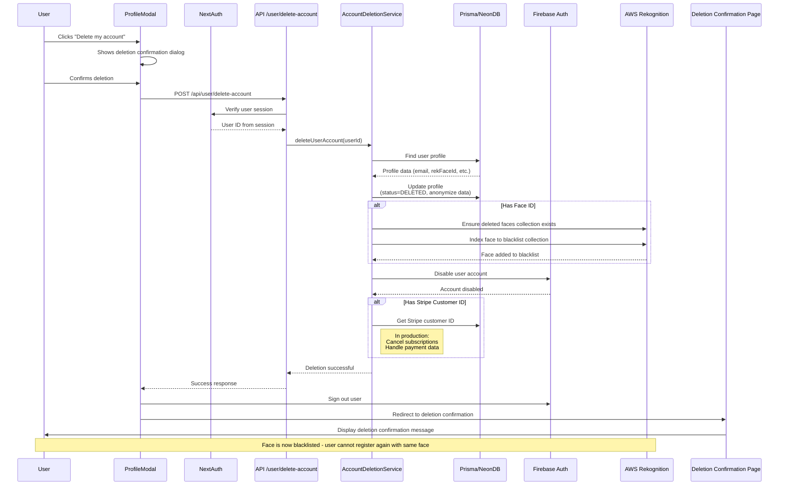

# Account Deletion Flow

This document outlines the secure account deletion process implemented across multiple systems.

## Key Security Features

1. **Soft Deletion with Anonymization**
   - Profiles are marked as DELETED but records are preserved
   - Personal data (email, nickname) is anonymized
   - System integrity and relationships are maintained

2. **Cross-Platform Coordination**
   - Firebase Auth: User account disabled
   - NeonDB: Profile data anonymized and status updated
   - AWS Rekognition: Face added to blacklist collection
   - Stripe: Customer information handled (subscriptions canceled in production)

3. **Face Recognition Blacklisting**
   - Prevents re-registration using the same face
   - Maintains platform integrity and security policies
   - Uses dedicated blacklist collection for efficiency

4. **User Experience**
   - Clear confirmation process
   - Feedback about permanent nature of deletion
   - Explicit notification about face recognition blacklisting
   - Dedicated confirmation page after successful deletion 