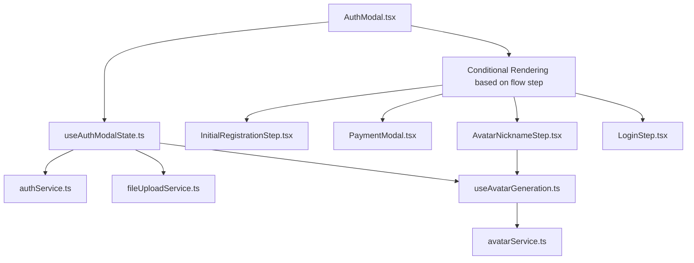

AuthModal.tsx (Orchestrator - uses useAuthModalState)
    |
    |--- (Conditional Rendering based on flow step)
    |       |--- InitialRegistrationStep.tsx (UI for step 1)
    |       |--- PaymentModal.tsx (Handles payment UI & Stripe Elements)
    |       |--- AvatarNicknameStep.tsx (UI for step 2 - uses useAvatarGeneration)
    |       |--- LoginStep.tsx (UI for login)
    |
    |--- useAuthModalState.ts (Manages flow state, user data across steps)
    |       |--- authService.ts (Calls to /api/auth/*, /api/check-face-duplicate, etc.)
    |       |--- fileUploadService.ts (Direct R2 uploads)
    |       |--- (interacts with useAvatarGeneration hook or avatarService directly)
    |
    |--- useAvatarGeneration.ts (Handles avatar SSE, progress)
            |--- avatarService.ts (Calls to /api/avatar-gen, /api/nickname)

