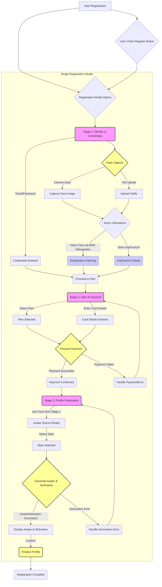

The architecture dillema: 

Right now we have setup vaiations for facial, avatar stuff:

1. User scans face -> rekognition index face -> we use that face to generate an avatar

2. User scans face -> rekognition index face -> user upload selfie to make avatar from -> validate selfie matches face -> generate avatar

3. User scans face -> upon complete -> index face -> avatar generation

I like the 3rd option because it would require user to scan their face and see the immediate flow, and value system.


```mermaid
-> entry to antropos city


