```mermaid
graph TD
    UserAction_Start["User clicks 'Enter Antropos City'"] --> ModalVisible["'Entry to Antropos City' Modal Appears"];

    subgraph "Entry to Antropos City Modal (Single View with Steps)"
        direction TB
        
        StepperUI["Stepper Nav: [1. Identity] -> [2. Allegiance] -> [3. Manifestation]"]

        subgraph "View 1: Identity Protocol (Email, Password, Face Scan)"
            direction TB
            V1_Header["Header: Establish Your Digital Identity"]
            V1_EmailInput["Email Input Field"]
            V1_PasswordInput["Password Input Field"]
            V1_FaceScanArea["Live Camera Preview / Upload Option"]
            V1_ScanButton["Button: 'Scan Face' / 'Upload Photo'"]
            V1_ProcessingText["Status Text: 'Scanning...' / 'Analyzing...' / 'Face Indexed!'"]
            V1_NextButton["Button: 'Proceed to Allegiance' (Enabled after successful face index)"]

            V1_Header --> V1_EmailInput --> V1_PasswordInput --> V1_FaceScanArea --> V1_ScanButton;
            V1_ScanButton --> V1_ProcessingText;
            V1_ProcessingText -- Success --> V1_NextButton;
        end

        subgraph "View 2: Pledge Allegiance (Plan & Payment)"
            direction TB
            V2_Header["Header: Choose Your Allegiance Level"]
            V2_PlanOptions["Plan Selection Component (e.g., cards for different tiers)"]
            V2_PaymentForm["Stripe Payment Element"]
            V2_PayButton["Button: 'Confirm & Pay'"]
            V2_ProcessingPaymentText["Status Text: 'Processing Payment...' / 'Payment Successful!'"]
            V2_BackButton_Plan["Button: 'Back to Identity'"]
            V2_NextButton_Payment["Button: 'Manifest Your Avatar' (Enabled after successful payment)"]
            
            V2_Header --> V2_PlanOptions --> V2_PaymentForm --> V2_PayButton;
            V2_PayButton --> V2_ProcessingPaymentText;
            V2_ProcessingPaymentText -- Success --> V2_NextButton_Payment;
            V2_PlanOptions --> V2_BackButton_Plan;
        end

        subgraph "View 3: Avatar Manifestation (Style & Nickname)"
            direction TB
            V3_Header["Header: Manifest Your Digital Self"]
            V3_SourceImageDisplay["Display: Your Scanned Face (Source for Avatar)"]
            V3_StyleSelector["Avatar Style Selection Grid (e.g., male/female styles from AvatarNicknameStep)"]
            V3_GenerateButton["Button: 'Generate Avatar with Style'"]
            V3_AvatarProcessText["Status Text: 'Generating Avatar...'"]
            V3_GeneratedAvatar["Display: Generated Avatar"]
            V3_NicknameDisplay["Display/Input: Generated Nickname (Confirm/Edit?)"]
            V3_ConfirmButton["Button: 'Complete Entry to Antropos City'"]
            V3_BackButton_Avatar["Button: 'Back to Allegiance'"]

            V3_Header --> V3_SourceImageDisplay --> V3_StyleSelector --> V3_GenerateButton;
            V3_GenerateButton --> V3_AvatarProcessText -- Success --> V3_GeneratedAvatar;
            V3_GeneratedAvatar --> V3_NicknameDisplay --> V3_ConfirmButton;
            V3_StyleSelector --> V3_BackButton_Avatar;
        end
        
        StepperUI -.-> V1_Header;
        V1_NextButton ==> V2_Header;
        V2_BackButton_Plan ==> V1_Header;
        V2_NextButton_Payment ==> V3_Header;
        V3_BackButton_Avatar ==> V2_Header;
    end

    V3_ConfirmButton --> EntryComplete["Welcome to Antropos City! (Modal Closes)"];

    %% Class Definitions
    classDef modalContainer fill:#0a0a0a,stroke:#FFD700,stroke-width:2px,color:#fff;
    classDef buttonStyle fill:#FFD700,color:#000,stroke:#000;
    classDef textStyle color:#ccc;
    classDef headerStyle color:#FFD700,font-weight:bold;

    class ModalVisible modalContainer;
    class StepperUI textStyle;
    class V1_Header headerStyle;
    class V2_Header headerStyle;
    class V3_Header headerStyle;
    class V1_EmailInput textStyle;
    class V1_PasswordInput textStyle;
    class V1_FaceScanArea textStyle;
    class V1_ProcessingText textStyle;
    class V2_PlanOptions textStyle;
    class V2_PaymentForm textStyle;
    class V2_ProcessingPaymentText textStyle;
    class V3_SourceImageDisplay textStyle;
    class V3_StyleSelector textStyle;
    class V3_AvatarProcessText textStyle;
    class V3_GeneratedAvatar textStyle;
    class V3_NicknameDisplay textStyle;
    class V1_ScanButton buttonStyle;
    class V1_NextButton buttonStyle;
    class V2_PayButton buttonStyle;
    class V2_BackButton_Plan buttonStyle;
    class V2_NextButton_Payment buttonStyle;
    class V3_GenerateButton buttonStyle;
    class V3_ConfirmButton buttonStyle;
    class V3_BackButton_Avatar buttonStyle;
``` 

The architecture dilemma: 

Right now we have setup variations for facial, avatar stuff:
1. User scans face -> rekognition index face -> we use that face to generate an avatar

2. User scans face -> rekognition index face -> user upload selfie to make avatar from -> validate selfie matches face -> generate avatar

3. User scans face -> upon complete -> index face -> avatar generation

I like the 3rd option because it would require user to scan their face and see the immediate flow, and value system.

Also the best choice is to make registration page as base, where we would sell the user passport indentity, avatar gen, nickname and main city idea + benefits. 
now a few key decisions:

1. we can make payment as modal or as a whole new payment page.

2. We can make avatar gen integrated in the register page or make it a whole new page.

3. WE need to also figure out how to integrate the email + password + face scan. into all this. It would be best to happen along with the payment stuff.


New conclusion: 
Making a 3 step process in the register page: User gets sales in the first, then from it we get a glowing (beautiful futuristic effect) cord with a lock indicating user that to get this value you have to follow the cord and "unlock". Step 2 is payment and registration + face scan. Step 3 is avatar gen and nickname. Each section has to be clearly displayed as a sequence of steps, meaning the cord has to be like the start navigator and the next step has to be clearly displayed as the "next one"

---

# 🎨 DESIGN BRIEF: Antropos City Registration Page

## Overview
Design a single-page registration experience with a **3-step unlocking journey** that uses glowing energy cords and interactive locks as the primary navigation metaphor. The page should feel like unlocking access to an exclusive digital realm.

## Core Visual Metaphor
**"Follow the Energy Cord to Unlock Your Digital Destiny"**

### Layout Structure
```
┌─────────────────────────────────────────────────────────────┐
│                 ANTROPOS CITY HEADER                        │
├─────────────────────────────────────────────────────────────┤
│                                                             │
│    🎯 STEP 1        ✨~~~~~~🔒        📦 STEP 2 [HIDDEN]    │
│   [SALES PITCH]      CORD & LOCK      [PAYMENT + SCAN]      │
│     [VISIBLE]                                               │
│                                                             │
│                    ✨~~~~~~🔒         🎨 STEP 3 [HIDDEN]    │
│                    CORD & LOCK        [AVATAR + NICKNAME]   │
│                                                             │
└─────────────────────────────────────────────────────────────┘
```

## Step-by-Step Design Requirements

### **STEP 1: The Promise (Always Visible)**
**Content:** Value proposition and benefits
**Visual State:** Fully illuminated and interactive

**Design Elements:**
- **Hero Section:** Large, compelling headline "Claim Your Digital Passport"
- **Benefit Cards:** 3-4 animated cards showing:
  - Digital Identity Verification
  - Custom Avatar Generation
  - Exclusive City Access
  - Personalized Nickname
- **Visual Examples:** Sample avatars, city imagery, passport concept
- **Call-to-Action:** Prominent "Begin Your Journey" button that connects to the first cord

### **Energy Cord 1 → Lock 1**
**Visual:** Glowing energy cord extending from Step 1 to Lock 1
**States:**
- **Inactive:** Subtle golden glow (hex: #FFD700), gentle pulse every 3 seconds
- **Hover:** Brighter glow, faster pulse
- **Active:** Flowing energy particles along the cord

**Lock Design:**
- **Style:** Futuristic digital lock with hexagonal details
- **Size:** 60px x 60px
- **Glow:** Matching cord color with subtle particle effects
- **Animation:** Subtle rotation when hovered
- **Unlock Animation:** 2-second sequence - lock opens, particles burst, cord extends to reveal Step 2

### **STEP 2: Identity & Payment (Hidden → Revealed)**
**Content:** Registration form, face scan, plan selection, payment
**Visual State:** Hidden behind lock, revealed with slide-in animation

**Reveal Animation:**
- Lock unlock sequence (0.5s)
- Step 2 container slides in from right (0.8s)
- Content fades in sequentially (1.2s total)

**Layout Sections:**
1. **Identity Collection:**
   - Email input with floating label
   - Password input with strength indicator
   - Face scan interface with live camera preview

2. **Plan Selection:**
   - Tiered pricing cards with hover effects
   - Features comparison with checkmarks

3. **Payment Interface:**
   - Stripe payment element
   - Security badges and trust indicators

### **Energy Cord 2 → Lock 2**
**Visual:** Second cord appears only after Step 1 completion
**Color Progression:** Golden (#FFD700) → Blue-white (#4FC3F7) → Rainbow gradient
**Animation:** More dynamic than Cord 1, with flowing particles

### **STEP 3: Avatar Manifestation (Hidden → Revealed)**
**Content:** Avatar generation and nickname assignment
**Visual State:** Hidden until Step 2 completion

**Layout:**
- **Source Display:** User's scanned face in elegant frame
- **Style Selector:** Grid of avatar style options with hover previews
- **Generation Zone:** Large preview area for generated avatar
- **Nickname Display:** Generated nickname with edit capability
- **Completion Button:** Final "Enter Antropos City" action

### **Final Completion Effect**
**Animation:** All cords pulse simultaneously, rainbow gradient flows through entire system, final burst effect

## Color Palette & Themes

### **Primary Colors:**
- **Background:** Deep space black (#0a0a0a)
- **Primary Accent:** Golden yellow (#FFD700)
- **Secondary Accent:** Cyber blue (#4FC3F7)
- **Success State:** Emerald green (#10B981)
- **Text Primary:** Pure white (#FFFFFF)
- **Text Secondary:** Light gray (#D1D5DB)

### **Gradient Effects:**
- **Energy Cords:** Linear gradient with animated offset
- **Lock Glows:** Radial gradient with blur effects
- **Completion:** Rainbow gradient animation

## Typography

### **Headers:**
- **Font:** Futuristic sans-serif (e.g., Orbitron, Exo 2)
- **Step Titles:** 2.5rem, bold, golden color
- **Subtitles:** 1.25rem, medium weight

### **Body Text:**
- **Font:** Clean, readable sans-serif (e.g., Inter, Poppins)
- **Size:** 1rem base, 1.125rem for important content
- **Color:** Light gray with golden accents for key terms

## Interactive Elements

### **Buttons:**
- **Primary:** Golden background, black text, subtle glow
- **Secondary:** Transparent with golden border
- **Hover Effects:** Increase glow intensity, slight scale (1.05x)

### **Form Inputs:**
- **Style:** Dark background with golden focus states
- **Border:** Thin, gray when inactive, golden when focused
- **Labels:** Floating animation on focus

### **Cards/Panels:**
- **Background:** Semi-transparent dark (#1a1a1a80)
- **Border:** Subtle golden glow
- **Hover:** Increase glow, slight elevation shadow

## Animation Specifications

### **Cord Animations:**
- **Pulse Frequency:** Every 3 seconds when inactive
- **Flow Speed:** 2 seconds for particles to travel full length
- **Glow Intensity:** 20% base, 60% on hover, 100% when active

### **Lock Animations:**
- **Idle:** Subtle 360° rotation every 10 seconds
- **Hover:** Faster pulse, increased glow
- **Unlock Sequence:**
  1. Lock shakes (0.2s)
  2. Lock opens with satisfying click sound (0.5s)
  3. Particle burst effect (0.3s)
  4. Next section reveal begins

### **Step Reveal Animations:**
- **Timing:** CSS ease-out transitions
- **Duration:** 0.8-1.2 seconds total
- **Sequence:** Container → content → interactive elements

## Responsive Considerations

### **Desktop (1200px+):**
- Horizontal layout with all steps visible side-by-side
- Cords connect horizontally between sections

### **Tablet (768px - 1199px):**
- Vertical stacking with cords connecting vertically
- Maintain spacing and proportions

### **Mobile (< 768px):**
- Single column layout
- Shorter cords, adapted lock positions
- Touch-friendly interaction areas (44px minimum)

## Technical Notes

### **Performance:**
- Use CSS animations over JavaScript where possible
- Implement intersection observer for performance
- Lazy load heavy assets (avatar examples, videos)

### **Accessibility:**
- Maintain focus indicators for keyboard navigation
- Provide alternative text for all visual elements
- Ensure color contrast meets WCAG standards
- Include skip links for screen readers

### **Browser Support:**
- Modern browsers with CSS Grid and Flexbox
- Graceful degradation for older browsers
- Progressive enhancement for animations

## Inspiration References
- **Visual Style:** Cyberpunk 2077 UI, Tron Legacy aesthetics
- **Animation Style:** Smooth, satisfying micro-interactions
- **Color Inspiration:** Golden hour lighting with neon accents
- **Typography:** Futuristic but readable, tech-forward brands

---

# 🚀 USER JOURNEY FLOW: Practical Implementation

## Updated Flow Based on Passport-Centric Design

### **SINGLE PAGE LAYOUT CONCEPT**

#### **What User Sees Initially:**
```
┌─────────────────────────────────────────────────────────────┐
│                                                             │
│           🏛️ Become Anthropos Citizen!                      │
│                                                             │
│  ┌─────────────────────────────────────────────────────┐   │
│  │  [PASSPORT PREVIEW - Anthropos Citizen Card]        │   │
│  │  ┌─────────────────┐  Anthropos Citizen            │   │
│  │  │   [Sample       │  Email: [Preview]              │   │
│  │  │   Avatar        │  Gender: [Dynamic]             │   │
│  │  │   Portrait]     │  € 000 000 001                 │   │
│  │  └─────────────────┘                                │   │
│  └─────────────────────────────────────────────────────┘   │
│                           │                                 │
│                    ✨~~~~~🔒 [Golden Cord + Lock]           │
│                           │                                 │
│  ┌─────────────────────────────────────────────────────┐   │
│  │        Create your Anthropos Avatar                 │   │
│  │                                                     │   │
│  │  Enter your email                                   │   │
│  │  [_____________________] Email input               │   │
│  │  [_____________________] Password input            │   │
│  │                                                     │   │
│  │  Upload your photo          ┌─ Unlock Anthropos ─┐ │   │
│  │  ┌─────────────┐            │ City                │ │   │
│  │  │     [+]     │            │ 0.99€/month         │ │   │
│  │  │   Upload    │            │ 9.99€/year (save    │ │   │
│  │  │   Area      │            │ 20%)                │ │   │
│  │  └─────────────┘            └─────────────────────┘ │   │
│  │                                                     │   │
│  │  Choose your style                                  │   │
│  │  [Tech] [Art] [Retro] [Business] [More Styles...]  │   │
│  │                                                     │   │
│  │  [Generate Avatar] [Generate Avatar] (duplicate?)   │   │
│  └─────────────────────────────────────────────────────┘   │
└─────────────────────────────────────────────────────────────┘
```

### **PHASE 1: PASSPORT VISION & FORM INTERACTION (0-30 seconds)**

#### **User Actions & System Response:**

**1A. Initial Page Load:**
```
System Response:
├─ Passport card animates in from top (1s)
├─ Sample avatar glows with golden border
├─ Cord extends downward with gentle pulse
├─ Lock rotates slowly, drawing attention
└─ Form section fades in below (1.5s total)
```

**1B. Form Interaction Begins:**
```
User Action: Clicks email field
System Response:
├─ Field highlights with golden border
├─ Floating label animation
├─ Passport preview updates with typed email in real-time
└─ Cord pulse increases slightly

User Action: Types password
System Response:
├─ Strength indicator appears
├─ Password criteria checklist shows
└─ Passport card gains more definition/clarity
```

**1C. Photo Upload Process:**
```
User Action: Clicks upload area OR drags photo
System Response:
├─ Upload area highlights with golden glow
├─ File picker opens / drag zone activates
├─ Image preview appears in upload area
├─ Face detection validation runs
├─ Success: "✓ Face detected" confirmation
└─ Passport preview updates with user's photo

Alternative: Camera Capture Option
├─ "Use Camera" button appears
├─ Camera permission request
├─ Live preview in upload area
├─ "Capture" button overlay
└─ Same success flow as file upload
```

### **PHASE 2: STYLE SELECTION & PAYMENT (30 seconds - 2 minutes)**

#### **Style Selection Experience:**
```
User Action: Hovers over style options
System Response:
├─ Style preview highlights with golden border
├─ Passport card shows style applied to user's photo
├─ Smooth transition between style previews
└─ "Choose your style" text updates to style name

User Action: Clicks style (Technology/Art/Retro/Business)
System Response:
├─ Selected style locks in with confirmation animation
├─ Passport preview shows final style applied
├─ Payment section becomes more prominent
├─ "Generate Avatar" buttons activate
└─ Cord to lock brightens significantly
```

#### **Embedded Payment Flow:**
```
Payment Section Layout:
┌─ Unlock Anthropos City ────────────────┐
│ 💳 [Stripe Payment Element]            │
│ ┌─────────────────────────────────────┐ │
│ │ 0.99€/month    [SELECT]            │ │
│ └─────────────────────────────────────┘ │
│ ┌─────────────────────────────────────┐ │
│ │ 9.99€/year (save 20%)  [SELECT]   │ │
│ └─────────────────────────────────────┘ │
│                                        │
│ [🔒 Complete Citizenship Registration] │
└────────────────────────────────────────┘

User Action: Selects pricing plan
System Response:
├─ Selected plan highlights in gold
├─ Payment form becomes active
├─ Trust badges and security indicators appear
└─ Final button changes to "Generate & Complete"

User Action: Enters payment details
System Response:
├─ Real-time validation with green checkmarks
├─ Security badges pulse to show safety
├─ Passport card gains "PROCESSING" overlay
└─ Generate Avatar buttons become primary focus
```

### **PHASE 3: AVATAR GENERATION & COMPLETION (1-2 minutes)**

#### **Avatar Generation Trigger:**
```
User Action: Clicks "Generate Avatar" (either button)
System Response:
├─ Lock animation begins (2s unlock sequence)
├─ Cord energy flows upward toward passport
├─ Payment processing begins in background
├─ "Generating your digital identity..." loading
├─ Progress bar with inspiring messages
└─ API calls: Payment + Face Upload + Avatar Generation

Lock Unlock Animation Sequence:
1. Lock shakes and glows intensely (0.5s)
2. Lock opens with satisfying click sound (0.5s)
3. Golden energy bursts from lock (0.5s)
4. Energy flows up cord to passport (0.5s)
5. Passport card glows and transforms
```

#### **Final Passport Reveal:**
```
Success Animation:
├─ Generated avatar appears in passport card
├─ User's real email populates
├─ Unique citizen ID generates
├─ "VERIFIED" stamp appears
├─ Passport card pulses with golden glow
├─ Confetti/particle celebration effect
└─ "Welcome to Anthropos City!" message

Final State:
┌─────────────────────────────────────────┐
│  ✓ VERIFIED Anthropos Citizen Card      │
│  ┌─────────────────┐  Anthropos Citizen │
│  │   [User's       │  Email: user@x.com │
│  │   Generated     │  Gender: Male       │
│  │   Avatar]       │  € 000 000 042      │
│  └─────────────────┘  [VERIFIED STAMP]  │
└─────────────────────────────────────────┘
```

### **PHASE 4: COMPLETION & DASHBOARD TRANSITION (5-10 seconds)**

#### **Final Success Sequence:**
```
1. Passport card confirmation animation (1s)
2. "Welcome Citizen [Email]!" message appears (1s)
3. "Access Granted to Anthropos City" notification (1s)
4. Golden particle burst celebration (2s)
5. Smooth transition to main dashboard/city (2s)
```

---

## 🎯 UPDATED INTERACTION PATTERNS

### **Real-Time Passport Preview:**
- **Live Updates**: Email, gender, avatar style update instantly in passport
- **Progressive Enhancement**: Card becomes more defined as form completes
- **Visual Validation**: Green checkmarks appear on passport elements when valid

### **Embedded Payment UX:**
- **Plan Selection**: Clear monthly vs yearly options with savings highlight
- **Trust Indicators**: Security badges, SSL certificates, payment provider logos
- **Single Flow**: No separate payment pages, everything on one view
- **Progressive Pricing**: Price updates in real-time based on selections

### **Style Selection Enhancement:**
- **Live Preview**: Passport shows style applied to user's photo in real-time
- **Style Categories**: Technology, Art, Retro, Business as core options
- **Expandable Options**: "More Styles..." for additional choices
- **Gender Detection**: Auto-suggests appropriate style categories

### **Streamlined Avatar Generation:**
- **Dual Triggers**: Two "Generate Avatar" buttons for redundancy
- **Combined Processing**: Payment + Avatar generation happen simultaneously
- **Clear Loading**: Progress indicators with city-themed messages
- **Instant Gratification**: Avatar appears in passport immediately upon generation

### **Error Handling Scenarios:**
```
Payment Failure:
├─ Passport card shows "PAYMENT REQUIRED" overlay
├─ Form highlights payment section in red
├─ Clear retry options with support contact
└─ Progress saved, user doesn't lose avatar/style choices

Photo Upload Issues:
├─ "No face detected" → Gentle guidance for better photo
├─ "Multiple faces detected" → Crop tool to select primary face
├─ "Poor quality" → Suggestions for better lighting/angle
└─ Camera fallback if upload fails

Avatar Generation Failure:
├─ "Generation failed" → Option to retry with same or different style
├─ Partial refund offer if technical issues persist
├─ Alternative: Manual avatar selection from gallery
└─ Support escalation with saved progress
```

### **Data Collection & Storage:**
```json
{
  "anthroposCitizen": {
    "email": "user@example.com",
    "password": "hashed_securely",
    "uploadedPhotoUrl": "s3_temp_url",
    "selectedStyle": "technology",
    "selectedPlan": "yearly_9_99",
    "paymentStatus": "completed",
    "generatedAvatarUrl": "cdn_avatar_url",
    "citizenId": "000000042",
    "passportVerified": true,
    "cityAccess": true,
    "registrationDate": "2024-01-15T10:30:00Z"
  }
}
```

This updated flow creates a much more cohesive experience where the passport serves as both the goal and the progress indicator, with all functionality embedded in a single, engaging view.

---

# 🚀 REFINED: "FORGE YOUR PASSPORT" SINGLE-FLOW ARCHITECTURE

## Overview: From Multi-Step to Unified Journey

Your refined proposal brilliantly transforms the registration from a multi-step process into a **single, continuous "passport forging" experience**. This approach eliminates friction while maintaining the high-tech, exclusive feel of entering Antropos City.

## 🎯 Core Design Principles

### 1. **Citizenship as the Central Product**
- Users are purchasing **"entry to Antropos City"** citizenship status
- Avatar, nickname, Q&A access are secondary perks that flow from citizenship
- The passport card becomes both the goal and progress indicator

### 2. **Trust-First Biometric Gates**
- Face scanning feels like **high-tech city gates**, not file uploads
- In-page camera with face-mesh overlay (no pop-ups)
- Progressive field unlocking builds psychological comfort

### 3. **Real-Time Forging Animations**
- **"Molten passport"** creation with golden sparks and code streams
- Users watch their digital identity being forged in real-time
- Builds trust through visible, advanced technology demonstration

### 4. **Linear, Cord-Guided Flow**
- Single scrollable page with **glowing energy cord** as visual pathfinder
- Cord pulses and changes color to indicate progress and next steps
- Lock icons along the cord represent "gates" to unlock

## 📋 Single-Flow Structure

```
┌──────────────────── HERO: PASSPORT VISION ────────────────────┐
│ 🏛️ BECOME ANTHROPOS CITIZEN!                                  │
│                                                               │
│ ┌─────────────────────────────────────────────────────────┐   │
│ │      [3D Digital Passport - Empty, Waiting to Forge]    │   │
│ │                                                         │   │
│ │  ✦ Your All-Access Digital Passport                    │   │
│ │  ✦ City-Grade Q&A Privileges                           │   │
│ │  ✦ AI-Forged Avatar & Nickname                         │   │
│ └─────────────────────────────────────────────────────────┘   │
│                                                               │
│        [🔬 START YOUR BIO-SCAN & FORGE PASSPORT]               │
│                                                               │
└───────────────────────────────────────────────────────────────┘
                              │
                    ✨~~~~~🔒~~~~~✨ (Golden Energy Cord)
                              │
┌────────────── IDENTITY VERIFICATION & PAYMENT ────────────────┐
│ 🔬 Verify Your Identity (Step 1 of 2: High-tech biometric gate)│
│                                                               │
│ ┌─────────────────────┐  ┌─────────────────────────────────┐  │
│ │   CAMERA VIEWFINDER │  │  ACCOUNT & PAYMENT DETAILS     │  │
│ │                     │  │                                 │  │
│ │  [Face-mesh overlay]│  │  Email: [locked until scan]    │  │
│ │  [BEGIN BIOMETRIC   │  │  Password: [locked until scan]  │  │
│ │   SCAN] button      │  │                                 │  │
│ │                     │  │  Card: [locked until valid]    │  │
│ │  Status: "Scanning" │  │  MM/YY: [ ] CVC: [ ]           │  │
│ │  → "✓ Face Verified"│  │                                 │  │
│ └─────────────────────┘  └─────────────────────────────────┘  │
│                                                               │
│        [🔒 COMPLETE & FORGE PASSPORT] (disabled until all valid)│
└───────────────────────────────────────────────────────────────┘
                              │
                    ✨ FORGING ANIMATION ✨ (2.5s overlay)
                              │
┌─────────────── AVATAR MANIFESTATION & COMPLETION ─────────────┐
│ 🎨 Create Your Anthropos Avatar (Step 2 of 2)                 │
│                                                               │
│ Hero passport now shows: [User's Face + "PROCESSING" overlay] │
│                                                               │
│ Choose Your Style:                                            │
│ [Technology] [Art] [Retro] [Business]                         │
│                                                               │
│        [⚡ GENERATE AVATAR & COMPLETE REGISTRATION]            │
│                                                               │
│ ──────────── Rainbow Cord Pulse ────────────                 │
│                                                               │
│        [🏛️ CLAIM YOUR PASSPORT & ENTER ANTHROPOS CITY]        │
└───────────────────────────────────────────────────────────────┘
```

---

# 🔧 BACKEND INTEGRATION ARCHITECTURE

## Single-Request Submission Strategy

### **The "One-Shot" Registration Endpoint**

```typescript
// POST /api/registration/forge-passport
interface ForgePassportRequest {
  // Identity Data
  email: string;
  password: string;
  faceImageBase64: string; // Captured from camera
  
  // Payment Data  
  stripePaymentMethodId: string; // From Stripe Elements
  selectedPlan: 'monthly_0_99' | 'yearly_9_99';
  
  // Avatar Data
  selectedStyle: 'technology' | 'art' | 'retro' | 'business';
  
  // Metadata
  userAgent: string;
  sessionId: string;
}

interface ForgePassportResponse {
  success: boolean;
  citizenId: string;
  passportData: {
    avatarUrl: string;
    citizenNumber: string;
    verificationBadge: boolean;
  };
  redirectUrl: string; // Dashboard URL
  errors?: ValidationError[];
}
```

## 🏗️ Modular Backend Architecture

Following your DI/DIP principles, here's how the services would compose:

### **1. Registration Orchestrator Service**

```typescript
interface IRegistrationOrchestrator {
  forgePassport(request: ForgePassportRequest): Promise<ForgePassportResponse>;
}

class RegistrationOrchestrator implements IRegistrationOrchestrator {
  constructor(
    private faceVerificationService: IFaceVerificationService,
    private paymentProcessor: IPaymentProcessor,
    private avatarGenerator: IAvatarGenerator,
    private userAccountService: IUserAccountService,
    private passportFactory: IPassportFactory
  ) {}
  
  async forgePassport(request: ForgePassportRequest): Promise<ForgePassportResponse> {
    // Orchestrate the entire flow in one transaction
    return await this.databaseTransaction(async (tx) => {
      
      // 1. Face Verification & Indexing
      const faceVerification = await this.faceVerificationService.indexFace(
        request.faceImageBase64
      );
      
      // 2. Payment Processing
      const paymentResult = await this.paymentProcessor.processSubscription(
        request.stripePaymentMethodId,
        request.selectedPlan
      );
      
      // 3. Avatar Generation (parallel with account creation)
      const avatarGeneration = this.avatarGenerator.generateFromFace(
        request.faceImageBase64,
        request.selectedStyle
      );
      
      // 4. User Account Creation
      const userAccount = await this.userAccountService.createAccount({
        email: request.email,
        password: request.password,
        rekognitionFaceId: faceVerification.faceId,
        tmpFaceUrl: faceVerification.temporaryUrl,
        subscriptionId: paymentResult.subscriptionId
      }, tx);
      
      // 5. Avatar Completion
      const avatarResult = await avatarGeneration;
      
      // 6. Passport Forging
      const passport = await this.passportFactory.forgePassport({
        userId: userAccount.id,
        avatarUrl: avatarResult.url,
        faceVerified: faceVerification.verified,
        paymentVerified: paymentResult.success,
        citizenTier: request.selectedPlan
      }, tx);
      
      return {
        success: true,
        citizenId: passport.citizenId,
        passportData: passport.toPublicData(),
        redirectUrl: `/dashboard/${userAccount.id}`
      };
    });
  }
}
```

### **2. Face Verification Service**

```typescript
interface IFaceVerificationService {
  indexFace(imageBase64: string): Promise<FaceVerificationResult>;
}

class AWSRekognitionFaceService implements IFaceVerificationService {
  constructor(
    private rekognitionClient: AWS.Rekognition,
    private s3Service: IS3Service
  ) {}
  
  async indexFace(imageBase64: string): Promise<FaceVerificationResult> {
    // 1. Upload to S3 temporarily
    const s3Result = await this.s3Service.uploadTemporary(imageBase64);
    
    // 2. Index face in Rekognition
    const indexResult = await this.rekognitionClient.indexFaces({
      CollectionId: 'anthropos-citizens',
      Image: { S3Object: { Bucket: s3Result.bucket, Key: s3Result.key }},
      DetectionAttributes: ['ALL']
    });
    
    return {
      faceId: indexResult.FaceRecords[0].Face.FaceId,
      temporaryUrl: s3Result.temporaryUrl,
      verified: indexResult.FaceRecords.length > 0,
      confidence: indexResult.FaceRecords[0].Face.Confidence
    };
  }
}
```

### **3. Avatar Generation Service**

```typescript
interface IAvatarGenerator {
  generateFromFace(faceImageBase64: string, style: AvatarStyle): Promise<AvatarResult>;
}

class AnthroposAvatarService implements IAvatarGenerator {
  constructor(
    private avatarAPI: IAvatarAPIClient,
    private assetStorage: IAssetStorage
  ) {}
  
  async generateFromFace(faceImageBase64: string, style: AvatarStyle): Promise<AvatarResult> {
    // 1. Call avatar generation API
    const generationResult = await this.avatarAPI.generate({
      sourceImage: faceImageBase64,
      style: style,
      quality: 'high',
      format: 'png'
    });
    
    // 2. Store generated avatar permanently
    const storedAvatar = await this.assetStorage.storeAvatar(
      generationResult.imageData,
      {
        userId: generationResult.userId,
        style: style,
        generatedAt: new Date()
      }
    );
    
    return {
      url: storedAvatar.url,
      metadata: storedAvatar.metadata,
      generationId: generationResult.id
    };
  }
}
```

## 🔄 Transaction & Error Handling

### **Database Transaction Pattern**

```typescript
class RegistrationOrchestrator {
  private async databaseTransaction<T>(
    operation: (tx: DatabaseTransaction) => Promise<T>
  ): Promise<T> {
    const tx = await this.database.beginTransaction();
    
    try {
      const result = await operation(tx);
      await tx.commit();
      return result;
      
    } catch (error) {
      await tx.rollback();
      
      // Cleanup external resources
      await this.cleanupFailedRegistration(error);
      
      throw new RegistrationError(
        'Passport forging failed',
        error,
        this.categorizeError(error)
      );
    }
  }
  
  private async cleanupFailedRegistration(error: any) {
    // Cleanup S3 temporary files
    // Cancel Stripe payment if it went through
    // Remove face from Rekognition if indexed
    // Log for manual review
  }
}
```

### **Error Categories & User Experience**

```typescript
enum RegistrationErrorType {
  FACE_DETECTION_FAILED = 'FACE_DETECTION_FAILED',
  PAYMENT_DECLINED = 'PAYMENT_DECLINED',
  AVATAR_GENERATION_FAILED = 'AVATAR_GENERATION_FAILED',
  ACCOUNT_EXISTS = 'ACCOUNT_EXISTS',
  TECHNICAL_ERROR = 'TECHNICAL_ERROR'
}

// Frontend Error Handling
const handleRegistrationError = (error: RegistrationError) => {
  switch (error.type) {
    case 'FACE_DETECTION_FAILED':
      // Show camera guidance overlay
      showFaceDetectionHelp();
      break;
      
    case 'PAYMENT_DECLINED':
      // Highlight payment section, offer retry
      highlightPaymentSection();
      showPaymentRetryOptions();
      break;
      
    case 'AVATAR_GENERATION_FAILED':
      // Offer manual avatar selection
      showAvatarFallbackOptions();
      break;
      
    case 'ACCOUNT_EXISTS':
      // Offer sign-in instead
      showExistingAccountOptions();
      break;
      
    default:
      // Technical error - offer support contact
      showTechnicalErrorSupport();
  }
};
```

## 🎯 Frontend Integration Points

### **Form State Management**

```typescript
// React Context for Registration State
interface RegistrationState {
  // Progressive Form Data
  faceScanned: boolean;
  faceImageData: string | null;
  email: string;
  password: string;
  paymentMethod: Stripe.PaymentMethod | null;
  selectedStyle: AvatarStyle | null;
  
  // UI State
  currentSection: 'hero' | 'verification' | 'forging' | 'avatar' | 'complete';
  isForging: boolean;
  errors: Record<string, string>;
  
  // Passport Preview State
  passportPreview: {
    email: string;
    facePreview: string | null;
    avatarPreview: string | null;
    citizenId: string | null;
  };
}

// Progressive Field Unlocking Logic
const useProgressiveFormUnlocking = () => {
  const [state, setState] = useState<RegistrationState>();
  
  const unlockNextSection = useCallback(() => {
    if (state.faceScanned && !state.emailPasswordUnlocked) {
      // Animate email/password fields becoming available
      animateFieldUnlock(['email', 'password']);
      setState(s => ({ ...s, emailPasswordUnlocked: true }));
    }
    
    if (state.email && state.password && !state.paymentUnlocked) {
      // Animate payment fields becoming available
      animateFieldUnlock(['cardNumber', 'expiry', 'cvc']);
      setState(s => ({ ...s, paymentUnlocked: true }));
    }
  }, [state]);
  
  return { unlockNextSection };
};
```

### **Single Submission Handler**

```typescript
const usePassportForging = () => {
  const [registrationState] = useRegistrationContext();
  
  const forgePassport = useCallback(async () => {
    try {
      // Start forging animation
      setIsForging(true);
      showForgingOverlay();
      
      // Prepare submission data
      const submission: ForgePassportRequest = {
        email: registrationState.email,
        password: registrationState.password,
        faceImageBase64: registrationState.faceImageData,
        stripePaymentMethodId: registrationState.paymentMethod.id,
        selectedPlan: registrationState.selectedPlan,
        selectedStyle: registrationState.selectedStyle,
        userAgent: navigator.userAgent,
        sessionId: generateSessionId()
      };
      
      // Single API call for everything
      const result = await api.post('/registration/forge-passport', submission);
      
      if (result.success) {
        // Update passport preview with real data
        updatePassportPreview(result.passportData);
        
        // Complete forging animation
        completeForgingAnimation();
        
        // Unlock avatar section
        unlockAvatarSection();
        
        // Prepare for redirect
        prepareSuccessRedirect(result.redirectUrl);
        
      } else {
        throw new RegistrationError(result.errors);
      }
      
    } catch (error) {
      setIsForging(false);
      hideForgingOverlay();
      handleRegistrationError(error);
    }
  }, [registrationState]);
  
  return { forgePassport };
};
```

## 🚀 Performance & UX Optimizations

### **1. Parallel Processing**
- Face indexing and avatar generation can run in parallel
- Payment processing happens concurrently with account creation
- UI animations run independently of backend processing

### **2. Progressive Data Validation**
- Real-time email/password validation before payment unlock
- Face detection validation before allowing email entry
- Payment method validation before enabling final submission

### **3. Optimistic UI Updates**
- Passport preview updates immediately with form data
- Forging animation starts before backend confirmation
- User sees progress even during backend processing

### **4. Fallback Strategies**
- Camera access denied → file upload option
- Avatar generation fails → manual avatar selection
- Payment fails → multiple retry options with different methods

This architecture maintains your modular principles while delivering the seamless "forge your passport" experience. The single-request approach reduces network overhead while the transaction-based backend ensures data consistency even if individual services fail.


