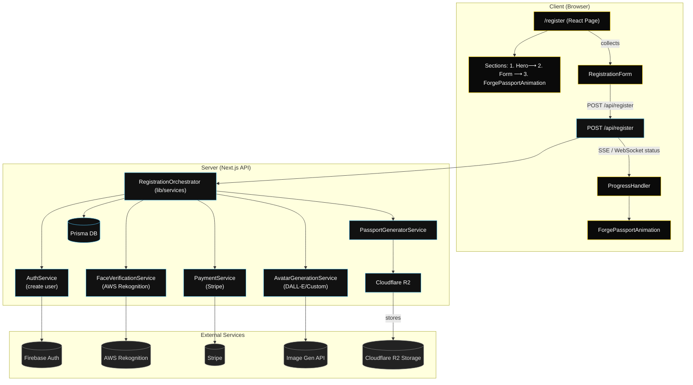

```mermaid
graph TD;
  %% --- Client Side ---
  subgraph "Client (Browser)"
    RP["/register (React Page)"]
    RP --> UI_Sections["Sections: 1. Hero⟶ 2. Form ⟶ 3. ForgePassportAnimation"]
    RP -->|collects| RegistrationForm
    RegistrationForm -->|POST /api/register| RegisterAPI
    RegisterAPI -->|SSE / WebSocket status| ProgressHandler
    ProgressHandler --> ForgePassportAnimation
  end

  %% --- Server Side ---
  subgraph "Server (Next.js API)"
    RegisterAPI["POST /api/register"]
    RegisterAPI --> Orchestrator["RegistrationOrchestrator (lib/services)"]
    Orchestrator --> AuthSvc["AuthService\n(create user)"]
    Orchestrator --> FaceSvc["FaceVerificationService\n(AWS Rekognition)"]
    Orchestrator --> PaySvc["PaymentService\n(Stripe)"]
    Orchestrator --> AvatarSvc["AvatarGenerationService\n(DALL-E/Custom)"]
    Orchestrator --> PassportSvc["PassportGeneratorService"]

    PassportSvc --> StorageR2["Cloudflare R2"]
    Orchestrator --> PrismaDB[("Prisma DB")] 
  end

  %% --- External Systems ---
  subgraph "External Services"
    Firebase[("Firebase Auth")]
    Rekognition[("AWS Rekognition")]
    Stripe[("Stripe")]
    Dalle[("Image Gen API")]
    R2[("Cloudflare R2 Storage")]
  end

  AuthSvc --> Firebase
  FaceSvc --> Rekognition
  PaySvc --> Stripe
  AvatarSvc --> Dalle
  StorageR2 --stores--> R2

  classDef client fill:#0a0a0a,stroke:#FFD700,color:#fff;
  classDef server fill:#111,stroke:#4FC3F7,color:#fff;
  classDef external fill:#222,stroke:#888,color:#ddd;

  class RP,UI_Sections,RegistrationForm,ProgressHandler,ForgePassportAnimation client;
  class RegisterAPI,Orchestrator,AuthSvc,FaceSvc,PaySvc,AvatarSvc,PassportSvc,StorageR2,PrismaDB server;
  class Firebase,Rekognition,Stripe,Dalle,R2 external;
``` 