Registration Saga / State Machine for user onboarding
=====================================================

```mermaid
stateDiagram-v2
    direction LR
    %% Legend: green – forward path, red – compensation/rollback

    [*] --> REGISTER_START
    REGISTER_START --> EMAIL_SENT: createFirebaseUser / sendLink

    EMAIL_SENT --> EMAIL_VERIFIED: emailVerified
    EMAIL_SENT --> ROLLBACK_PENDING: verificationTimeout / retry>3

    EMAIL_VERIFIED --> STRIPE_CUSTOMER_CREATED: stripe.customers.create
    STRIPE_CUSTOMER_CREATED --> PAYMENT_METHOD_ATTACHED: stripe.paymentMethods.attach
    PAYMENT_METHOD_ATTACHED --> SUBSCRIPTION_CREATED: stripe.subscriptions.create

    SUBSCRIPTION_CREATED --> PAYMENT_SUCCEEDED: payment_intent.succeeded
    SUBSCRIPTION_CREATED --> ROLLBACK_PENDING: paymentFailed(maxRetries)

    PAYMENT_SUCCEEDED --> AVATAR_JOB_ENQUEUED: qstash.publish(generate-assets)
    AVATAR_JOB_ENQUEUED --> AVATAR_READY: avatarGenerated
    AVATAR_JOB_ENQUEUED --> ROLLBACK_PENDING: avatarFailed(maxRetries)

    AVATAR_READY --> PROFILE_COMPLETED: profileFilled
    PROFILE_COMPLETED --> ACTIVE: systemReady

    ROLLBACK_PENDING --> ROLLBACK_DONE: compensationActions
    ROLLBACK_DONE --> [*]
```



### DB Schema additions

```prisma
model RegistrationState {
  profileId      String   @id  @map("profile_id")
  status         String   @default("REGISTER_START")
  retryCount     Int      @default(0)
  meta           Json?
  lastModifiedAt DateTime @updatedAt

  profile Profile @relation(fields: [profileId], references: [id], onDelete: Cascade)

  @@map("registration_state")
}
```

• `status` – finite-state string matching diagram nodes.  
• `retryCount` – incremented by each failed attempt; workers bail & push to `ROLLBACK_PENDING` once it exceeds 3.  
• `meta` – step-specific payload (error, Stripe IDs, etc.).

### Helper API

```ts
export async function advanceRegState(
  tx: PrismaTransaction,
  profileId: string,
  nextStatus: RegistrationStatus,
  meta?: JsonValue,
) { /* uses withPrismaRetry, idempotent check, ++retryCount on failure */ }
```

Every server step (API route, webhook handler, QStash job) calls `advanceRegState` right before and after its main I/O; rollback workers watch for `ROLLBACK_PENDING` to trigger compensating actions (cancel subscription, delete customer, clean claims, etc.).

Front-end simply polls `/api/user/profile-status` and renders the correct UI for the `status` value; no more brittle localStorage flags. 

one point of pivot:


The most important step in the registration process regarding ux is payment, it has to be made sure to succeed. It cannot fail, for this the logic has to be safeguarded: 
If a user makes a payment 